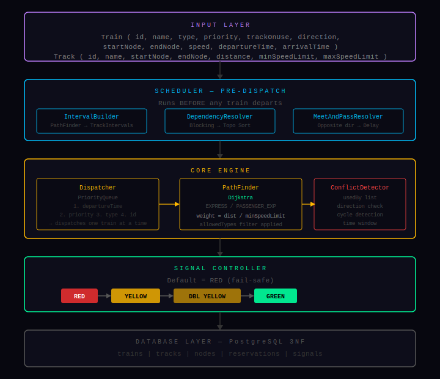
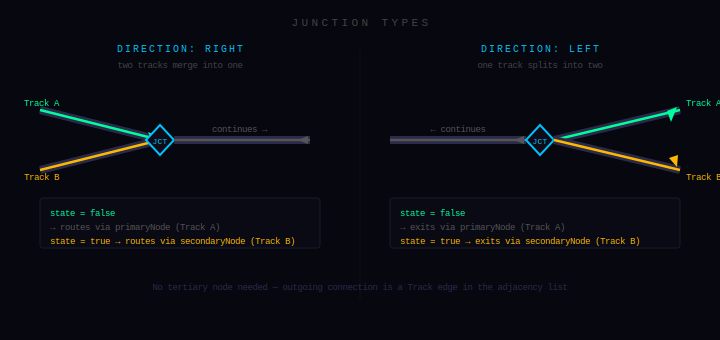
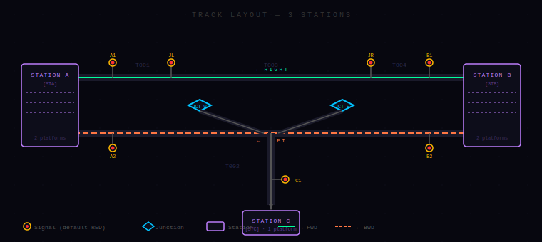

# Railway Automatic Interlocking

An algorithm-driven railway traffic management system that schedules trains before dispatch, detects route conflicts, manages interlocking decisions, and drives signal transitions in a fail-safe way.

---

## Compiling and Executing

```bash
javac -d out -sourcepath src src\Main.java
java -cp out Main
```

---

## Architecture



This diagram captures the runtime control flow: path planning and scheduling happen first, then dispatch, then real-time conflict and signal control. The design keeps route planning separate from movement authorization so a train never enters a track without a fresh safety check. In V1, all components run in memory and exchange typed model objects directly.



This layer view focuses on junction behavior: a junction stores topological pointers (`facingPointer` and `divergingPointer`) plus a mechanical switch state. Routing and movement checks apply the same incoming-side rules during path expansion and runtime conflict validation, so planning-time and movement-time behavior stay consistent. Junction isolation is used to prevent competing usage during traversal.



This illustration represents the physical topology abstraction used by the graph engine. Nodes model signal and junction points, while tracks model directional traversal opportunities with speed and occupancy constraints. The same graph supports forward and reverse traversals through `TrackTraversal` direction tagging.

---

## Class Hierarchy

```text
Node (abstract)
├── SignalNode
├── JunctionNode
└── OriginNode

Track
Train
TrackTraversal
TrackInterval
```

`Node` provides common identity semantics and concrete node types define signaling and routing behavior. `Track` and `TrackTraversal` separate infrastructure from movement direction, which keeps graph storage simple but preserves route intent. `Train` stores runtime movement state, schedule state, and integrity indicators used by safety logic.

---

## Dispatch Ordering

Dispatch priority is time-first and conflict-aware. The dispatcher sorts by departure time, then service priority, then train type, then train id, while the scheduler can still reorder train execution in the presence of physical blocking dependencies.

---

## Signal States

The implementation uses MACL-style aspects through `SignalState`: RED, YELLOW, DOUBLE_YELLOW, and GREEN. RED is the default and resting state, GREEN is an authorization state, and yellow aspects are cautionary states for approach control. Operationally, aspect changes are controlled through `SignalController` after rule evaluation.

---

## Junction Model

A `JunctionNode` models turnout behavior using a `facingPointer`, a `divergingPointer`, and a boolean mechanical `state`. The straight path is implicit: any connected node that is not either pointer is treated as the straight-side connection. The rules are topology-first and direction-agnostic: arriving from facing side routes to diverging when active and to straight when inactive; arriving from diverging side is blocked when inactive; arriving from straight side is blocked when active.

---

## Scheduling and Movement

The scheduler computes paths and occupancy intervals before dispatch so conflicts are detected early. During dispatch, each attempted track entry is revalidated by runtime checks, including occupancy, direction conflict, deadlock, overlap, and junction availability checks. This two-stage approach prevents both planning-time and movement-time safety regressions.

---

## Algorithm Stack

| Problem | Algorithm |
|---|---|
| Dispatch queueing | Priority queue comparator |
| Route finding | Dijkstra |
| Deadlock detection | DFS cycle detection |
| Blocking precedence | Topological sort |
| Opposing traffic timing | Interval overlap and delay propagation |
| Circular shunting fallback | BFS state search |

## Indian Railways Standards Compliance

The codebase already aligns with several core Indian Railways signaling principles for V1 simulation: fail-safe default RED behavior is implemented at signal construction, one-train-per-conflicting-section logic is represented through occupancy and conflict checks, and overlap-aware gating exists in the signal rule chain. Interlocking preconditions are partially represented because route checks are enforced before signal clearance, and topology-based junction route validation plus isolation are applied before movement lock-in for the traversed path.

Some standards are only partially represented in V1 because the simulation is algorithmic rather than infrastructure-coupled. Fouling-point enforcement is modeled as data fields and overlap defaults, but geometric fouling validation against real switch geometry and approach distances is not fully computed in current movement authorization. Last-vehicle logic exists and is tracked, but automatic hardware-grade proving and strict hold-until-proved release behavior are not yet complete in the current runtime pipeline.

Certain standards are intentionally deferred to V2. Automatic block SPAD wait-and-proceed protocol, full route locking and holding lifecycle states, axle counter and track-circuit fusion, and strict shunting speed law enforcement all require additional domain state and infrastructure integration that exceeds the current in-memory V1 boundary.

---

## How It Works

1. The topology is built as a graph of nodes and tracks, and trains are registered with origin, destination, and schedule metadata.
2. The scheduler computes candidate paths and per-track intervals for each train before dispatch starts.
3. Dependency resolution and meet-pass adjustments rewrite effective departure ordering when physical blocking or interval conflicts are found.
4. The dispatcher emits trains in queue order, and each movement step requests a safety decision from `ConflictDetector`.
5. If the path segment is safe, the protecting signal is requested to clear through `SignalController` under rule validation.
6. Only after signal clearance succeeds does track entry reserve occupancy and isolate any active junction scope.
7. Track exit releases occupancy and junction isolation for that train id and records integrity-related warnings when needed.
8. The cycle repeats until all trains complete or are held pending future safe authorization.

---

## Project Structure

The `model` package defines all domain entities used by scheduling, dispatch, and signaling subsystems.
The `core` package contains graph, path, dispatch, and conflict orchestration logic.
The `conflict` package isolates specialized conflict primitives and deadlock/shunting resolution algorithms.
The `signal` package encapsulates signal aspect transitions and signal-clear precondition rules.
The `scheduler` package performs pre-dispatch path, interval, dependency, and meet-pass planning.
The `db` package is a V2 scaffold for persistence and schema ownership.

```text
src/
  Main.java
  conflict/
    DeadlockDetector.java
    FollowingConflict.java
    HeadOnConflict.java
    ShuntingResolver.java
    TimeWindowConflict.java
  core/
    ConflictDetector.java
    Dispatcher.java
    GraphBuilder.java
    PathFinder.java
  db/
    DatabaseLayer.java
    schema.sql
  enums/
    Direction.java
    JunctionState.java
    Priority.java
    SignalType.java
    TrainType.java
  model/
    JunctionNode.java
    Node.java
    OriginNode.java
    SignalNode.java
    SignalState.java
    Track.java
    TrackInterval.java
    TrackTraversal.java
    Train.java
    TrainPriority.java
  scheduler/
    DependencyResolver.java
    IntervalBuilder.java
    MeetAndPassResolver.java
    TrainScheduler.java
  signal/
    SignalController.java
    SignalRule.java
  test/
    InterlockingTest.java
```

---

## Versioning

### V1 — Core Logic (Current)
The algorithmic core: graph-based path finding, conflict detection, signal control, and pre-dispatch scheduling. All logic runs in memory. No persistence, no API, no visual layer.

### V2 — Infrastructure
PostgreSQL persistence via DatabaseLayer. Spring Boot REST API. Automatic block pass protocol with wait timer. Gradient safety enforcement for shunting operations.

### V3 — Visualization
GraphStream live graph. React frontend with WebSocket. Real-time signal state display.

---

## Database Schema

```sql
CREATE TABLE tracks (
	track_id          VARCHAR(20) PRIMARY KEY,
	track_name        VARCHAR(100),
	start_node        VARCHAR(20),
	end_node          VARCHAR(20),
	distance          INT,
	min_speed_limit   DECIMAL(6,2),
	max_speed_limit   DECIMAL(6,2),
	in_use            BOOLEAN DEFAULT FALSE
);
```

---

## Tech Stack

- Language: Java
- Routing/Scheduling: Dijkstra, graph traversal, interval conflict logic
- Runtime safety: rule-based interlocking checks
- Database (planned): PostgreSQL

---

## License

MIT License - see [LICENSE](LICENSE) for details.

---

## Author

[Abishek Ganesh B S](https://github.com/notAbishek)
